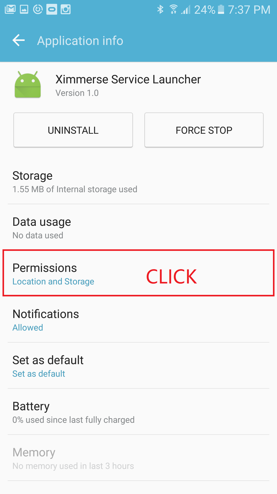
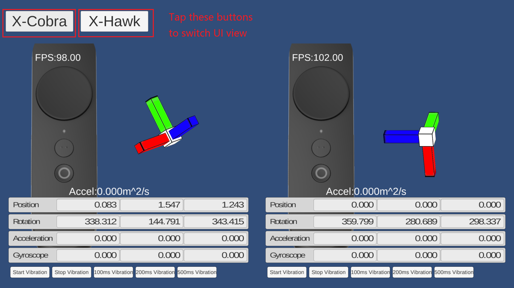

<!--toc-->

- [名词约定](#名词约定)
- [平台支持](#平台支持)
- [目录介绍](#目录介绍)
- [按键定义](#按键定义)
- [开发指南](#开发指南)
	- [Android手机运行环境安装](#android手机运行环境安装)
		- [1 应用安装](#1-应用安装)
		- [2 手柄配对](#2-手柄配对)
		- [3 应用权限检查](#3-应用权限检查)
		- [4 测试demo](#4-测试demo)
		- [5 演示demo](#5-演示demo)
	- [Unity SDK](#unity-sdk)
	- [Android SDK](#android-sdk)

<!-- tocstop -->

# 名词约定

名称 | 解释
---|---
controller | 手柄
HMD | 头戴显示器，即VR头显
X-Cobra|手柄的别称

# 平台支持
* 开发调试平台支持:
	* Windows 7/8/10
* 目标平台支持:
	* Android
* 3D引擎支持:
	* Unity3D

# 目录介绍
* **Demo**  	  ：针对主流的HMD，提供演示DEMO
* **Drivers**   ：平台驱动程序
* **Document\3DOF** ：说明文档
* **Native Android**：Android版本的SDK   
* **Native C++**：Windows C\++版本的SDK  
* **Tools**：工具包  
* **Unity**：Unity插件
* **Unreal**：Unreal插件  

&emsp;
# 按键定义

>  注：短按'home'键回中

&emsp;
# 开发指南

&emsp;
## Android手机运行环境安装

### 1 应用安装
1.1 在android手机上安装如下两个apk
> - [BTConfig.apk](https://github.com/Ximmerse/SDK/blob/master/Tools/AndroidXimService/BTConfig1.0.10(service-v2.0.1).apk): 用于手柄配对的工具
> - [DeviceTest.apk](https://github.com/Ximmerse/SDK/blob/master/Tools/AndroidXimService/DeviceTest.apk)：用于测试设备的工具，可以在手机上输出rotation、button等信息

&emsp;
### 2 手柄配对

2.1 装入电池，手柄自动开机。

2.2 打开手机上的蓝牙功能，并打开BTConfig工具。
>- 如果第一次打开BTConfig，会推荐安装"Ximmerse Service"，选择"Next"而后点击"Install"；

2.3 先按下BTConfig的Controller(R)的“Scan”按钮，然后同时按着手柄的'APP'和'HOME'键，配对成功后手柄状态变为"Paired"，退出应用；

> 手柄只需要配对一次；更换新的手柄时，重复“手柄配对”的步骤即可

&emsp;
### 3 应用权限检查
打开Application Manager，找到"Ximmerse Service Launcher"，点击"permissions",确认"location"和"storage"权限是打开的；这个步骤只需要做一次。

&emsp;

### 4 测试demo
设备和手机保持连接状态，运行[Device Test](https://github.com/Ximmerse/SDK/raw/master/Tools/AndroidXimService/DeviceTest.apk)，通过界面可观察到从手柄姿态、按键等信息。

  

&emsp;
### 5 演示demo
名称 | HMD
---|---
[Playground(Cardboards)](https://github.com/Ximmerse/SDK/blob/master/Demos/3DOF/Playground(Cardboards).apk) | Google Cardboards
[Playground(Gear VR)](https://github.com/Ximmerse/SDK/blob/master/Demos/3DOF/Playground(Gear%20VR).apk) | 三星Gear VR

&emsp;
## Unity SDK

获取unity插件和使用说明，请点击[地址](https://github.com/Ximmerse/SDK/tree/master/Unity).  

获取unity插件的FAQ，请点击[地址](https://github.com/Ximmerse/SDK/blob/master/Unity/FQA.md).  

获取unity插件API说明，请点击[地址](https://github.com/Ximmerse/SDK/blob/master/Unity/APIDoc.md).  

&emsp;
## Android SDK
获取Android SDK，请点击[地址](https://github.com/Ximmerse/SDK/tree/master/Native%20Android/)
获取Android SDK说明文档，请点击[地址]()
