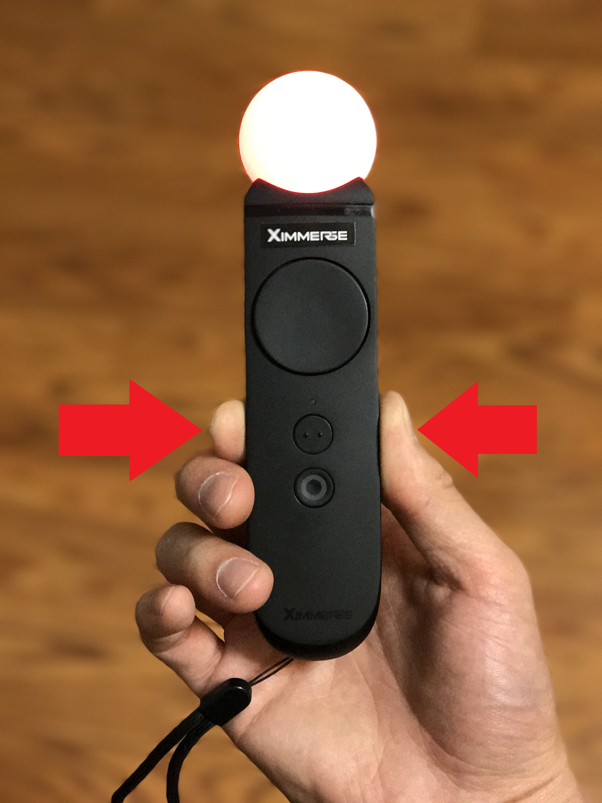
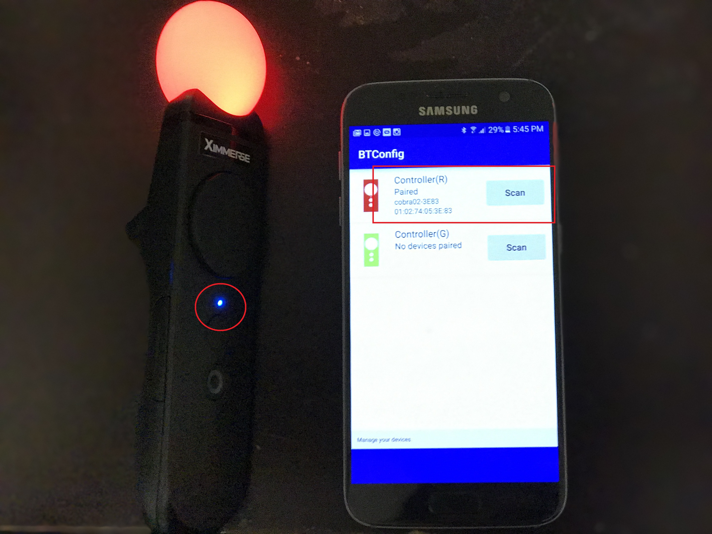

<!--toc-->

- [名词约定](#名词约定)
- [平台支持](#平台支持)
- [目录介绍](#目录介绍)
- [开发概述](#开发概述)
	- [Android手机运行环境安装](#android手机运行环境安装)
		- [1 应用安装](#1-应用安装)
		- [2 手柄配对](#2-手柄配对)
		- [3 后台服务设置](#3-后台服务设置)
		- [4 应用权限检查](#4-应用权限检查)
		- [5 运行测试Demo](#5-运行测试demo)
	- [Windows运行环境安装](#windows运行环境安装)
		- [1 驱动安装(CSR Dongle)](#1-驱动安装csr-dongle)
		- [2 驱动更新(USB HID)](#2-驱动更新usb-hid)
		- [3 手柄连接(XDeviceMonitor)](#3-手柄连接xdevicemonitor)
		- [4 运行测试Demo](#4-运行测试demo)
- [开发指南](#开发指南)
	- [Unity SDK](#unity-sdk)
	- [Android SDK](#android-sdk)
	- [Windows C++ SDK](#windows-c-sdk)

<!-- tocstop -->

# 名词约定

名称 | 解释
---|---
camera | 用于动作捕捉的摄像头
controller | 手柄
HMD | 头戴显示器，即VR头显
X-Hawk|摄像头的别称
X-Cobra|手柄的别称
Outside-In|camera外置，固定于墙上或三脚架上
Inside-Out|camera固定在HMD上,跟随HMD移动

# 平台支持
* 开发调试平台支持:
	* Windows 7/8/10
	* Mac OS X(暂不支持)
* 目标平台支持:
	* Android
	* iOS
	* Windows 10 (暂不支持)
* 3D引擎支持:
	* Unity3D
	* Unreal 4

# 目录介绍
* **Demo**  	  ：针对主流的HMD，提供演示DEMO
* **Drivers**   ：平台驱动程序
* **Document\DK04** ：说明文档
* **Native Android**：Android版本的SDK   
* **Native C++**：Windows C\++版本的SDK  
* **Tools**：工具包  
* **Unity**：Unity插件
* **Unreal**：Unreal插件  

# 开发概述
## Android手机运行环境安装

### 1 应用安装
1.1 通过USB电源线给camera供电
>- camera的LED灯呈现红色时，表示已经通电，但没有和头部信标建立通讯.
>- camera安装的高度约与用户眼睛水平位置一致

1.2 在android手机上安装如下两个apks
> - BTConfig.apk: 用于手柄配对的工具
> - DeviceTest.apk：用于测试设备的工具，可以在手机上输出position, rotation、button等信息

### 2 手柄配对

2.1 长按手柄的‘O’键大约3秒,打开两个手柄。
2.2 打开手机上的蓝牙功能，并打开BTConfig工具。
>- 如果第一次打开BTConfig，会推荐安装"Ximmerse Service"，选择"Next"而后点击"Install"；

2.3 分别按下BTConfig上的“Scan”按钮进行配对，手柄和应用程序的通过颜色对应。配对时需要同时按着手柄的两侧键，直到手柄的LED灯状态变为蓝色常亮，即手柄配对成功。

### 3 后台服务设置

把头部信标和手机通过OTG线相连，会出现与如下截图相似的对话框，选择将"Ximmerse Service Launcher"设置为默认应用。设置成功之后，每次插入头部跟踪信标, Ximmerse Service将自行启动。

### 4 应用权限检查
打开Application Manager，找到"Ximmerse Service Launcher"，点击"permissions",确认"location"和"storage"权限是打开的；这个步骤只需要做一次。

### 5 运行测试Demo
设备和手机保持连接状态，运行[Device Test](https://github.com/Ximmerse/SDK/raw/master/Tools/AndroidXimService/DeviceTest.apk)，通过界面可观察到从手柄的坐标、姿态、按键等信息，另外，通过点击UI上的'X-Hawk'和'X-Cobra'按钮，观察不同的数据。
> 设备处于连接状态时，手柄和Camera的指示灯保持蓝色常亮，头部信标也会保持蓝灯常亮；

## Windows运行环境安装
### 1 驱动安装(CSR Dongle)
请点击[地址](https://github.com/Ximmerse/SDK/tree/master/Drivers/CSR%20Drivers)，获取CSR dongle的驱动和安装说明。

### 2 驱动更新(USB HID)
1 将头部信标通过USB线和PC连接，打开“Device Manager”，发现新的“USB Input Device”设备；

2 点击右键，选择“Update Driver Software”

3 选择“Browse my computer for driver software”

4 选择“Let me pick from….”，出现窗口

5 选择“HID-compliant device”,点击“Next”，驱动更新完毕后，出现新的设备

### 3 手柄连接(XDeviceMonitor)
请点击[地址](https://github.com/Ximmerse/SDK/tree/master/Tools/XDeviceMonitor)，获取手柄连接工具XDeviceMonitor和它的使用说明。

### 4 运行测试Demo
手柄、camera和PC连接成功后，打开测试用例” DeviceTest”，可观察到手柄按键信息、位置信息和姿态信息。

# 开发指南
## Unity SDK
获取unity插件和开发指南，请点击[地址](https://github.com/Ximmerse/SDK/tree/master/Unity).
获取unity插件的FAQ，请点击[地址](https://github.com/Ximmerse/SDK/blob/master/Unity/FQA.md).
获取unity插件API说明，请点击[地址](https://github.com/Ximmerse/SDK/blob/master/Unity/APIDoc.md).
## Android SDK
有待完善
## Windows C++ SDK
有待完善
