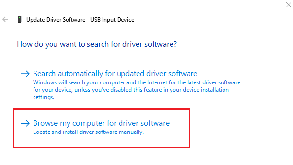
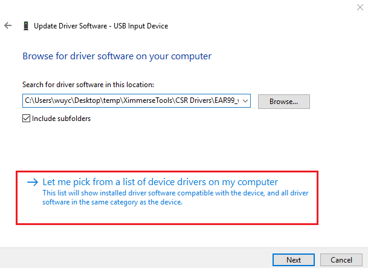
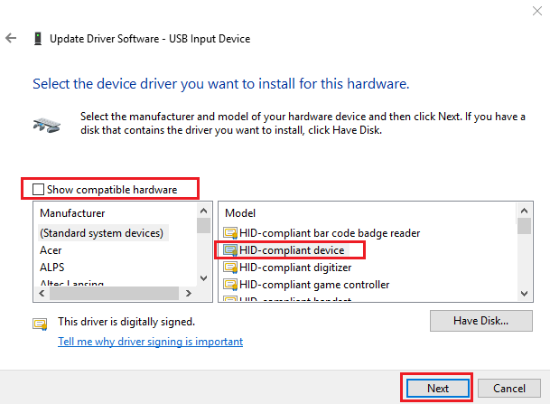
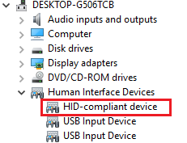

<h1>DK04 FAQ</h1>
**1. How to tell if the camera is functioning?**

>  Camera is functioning and sending data when the LED is flashing in blue.

&emsp;

**2. Gear VR headset doesn't power up head tracking blob.**
>  Only 2nd gen and 4th gen Gear VRs are supported.

&emsp;

**3. Controllers are connected in BTConfig, but I can't see controller moving in the game.**

>  Controllers positions are transimited through USB cable, please make sure your camera is functioning correctly and heading tracking blob is turned on.

&emsp;

**4. When running PickCube demo in Gear VR, it prompts "thread priority security exception, make sure the apk is signed".**

>  You have to make sure your apk includes the osig files generated from Oculus developer website. More info [here](https://docs.unity3d.com/Manual/VRDevices-Oculus.html).

&emsp;

**5. How to config All-in-One VR HMD?**

>  For Android powered All-in-One HMDs, you could use third party softwares(vysor、total Control) to control the HMD from your PCs.

&emsp;

**6. How to re-center my devices?**

> * Press one of the controllers' "Home" button will re-cener the device orientation only.
> * Press both of the controller "Home" button will re-center device orientation and virtual world coordinates.

&emsp;

**5. My Windows PC doesn't receive any position data.**
> If your device works on your phone, but it doesn't work on your windows PC. You may have a USB driver issue. Follow the following steps to get it solved:
> 	1. Go to "Device Manager" and check it you have any warning on any of the HID devices.

>	2. Click on “Browse my computer for driver software”

>	3. Click on “Let me pick from…."

>	4. Select “HID-compliant device”, then hit “Next” to update the device driver.

