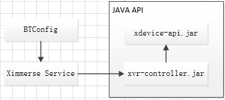
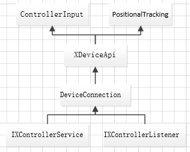

<!--toc-->

- [1.系统结构](#1系统结构)
		- [1.1 总体结构](#11-总体结构)
		- [1.2 Java API实现框架](#12-java-api实现框架)
- [2.Java API说明](#2java-api说明)
	- [2.1 package介绍](#21-package介绍)
	- [2.2 API说明](#22-api说明)
			- [1) com.ximmerse.sdk.XDeviceApi](#1-comximmersesdkxdeviceapi)
			- [2) com.ximmerse.sdk.XDeviceConstants](#2-comximmersesdkxdeviceconstants)
			- [3) com.ximmerse.input.ControllerInput.State](#3-comximmerseinputcontrollerinputstate)

<!-- tocstop -->

# 1.系统结构

### 1.1 总体结构

&emsp;
Android SDK分成3个部分：
- **BTConfig**: 用于蓝牙手柄绑定
- **Ximmerse Service**:后台服务，用于推送数据
- **Java API**:应用开发接口
&emsp;

Item | 名称 | 说明
---|---|---
1|BTConfig|手柄绑定程式
2|Ximmerse Service Launcher|后台服务程式，作为插件包含在BTConfig里，在安装BTConfig工具时，自动提示安装
3|xvr-controller.jar|后台服务通信接口
4|xdevice-api.jar|应用开发接口

&emsp;

### 1.2 Java API实现框架

Item | Class | 说明
---|---|---
1|IXControllerService|后台服务接口
2|IXControllerListener|后台服务监听接口
3|DeviceConnection|设备的客户端接口，实现后后台服务通信
4|XDeviceApi|应用开发统一封装
5|ControllerInput|手柄的接口
6|PositionalTracking|头部 Mark的接口

# 2.Java API说明
## 2.1 package介绍
Item | 名称 | 说明
---|---|---
1|com.ximmerse.input|输入外设接口
2|com.ximmerse.sdk|sdk统一封装接口
3|com.ximmerse.vr.vrcore.controller.api|后台服务通信接口

&emsp;
## 2.2 API说明

类名 | 用途
---|---
com.ximmerse.sdk.XDeviceApi| XDevice API接口，为静态方法
com.ximmerse.sdk.XDeviceConstants|XDevice 常量定义
com.ximmerse.input.ControllerInput | 手柄控制器
com.ximmerse.input.ControllerInput.State|手柄控制器消息
com.ximmerse.input.PositionalTracking | 位置跟踪器(3DOF Controller无该功能)
com.ximmerse.hardware.DeviceConnection| 设备的客户端接口

&emsp;
#### 1) com.ximmerse.sdk.XDeviceApi

方法 | 用途
---|---
public static int init(Context context) | 初始化
public static int exit()|退出
public static int getInputDeviceHandle(String name) | 获取设备句柄
public static int updateInputState(int which) | 更新设备状态
public static int getInt(int which, int fieldID, int defaultValue) | 获取设备int域的属性,属性定义参见XDeviceConstants
public static boolean getBool(int which, int fieldID, boolean defaultValue)|获取设备boolean域的属性
public static float getFloat(int which, int fieldID, float defaultValue) |获取设备Float域的属性
public static int sendMessage(int which, int Msg, int wParam, int lParam) |向设备发送消息
&emsp;

#### 2) com.ximmerse.sdk.XDeviceConstants
设备属性 | 用途
---|---
kField_ConnectionState | 设备连接状态
kField_BatteryLevel|设备电量
kField_ErrorCode|错误码

设备连接状态|说明
---|---
kConnectionState_Disconnected|断开连接
kConnectionState_Scanning|正在扫描
kConnectionState_Connecting|正在连接
kConnectionState_Connected|已经连接
kConnectionState_Error|连接错误，可通过读取设备的ErrorCode获取错误码

消息(Message)|说明
---|---
kMessage_TriggerVibration|电机振动
kMessage_RecenterSensor|回正

&emsp;
#### 3) com.ximmerse.input.ControllerInput.State
> 按键定义请参考[microsoft gamepad](https://msdn.microsoft.com/en-us/library/windows/apps/microsoft.directx_sdk.reference.xinput_gamepad)

方法|说明
---|---
public void updateState() |更新状态
public boolean getButton(int buttonMask)|获取按键事件
public boolean getButtonDown(int buttonMask)|按键按下
public boolean getButtonUp(int buttonMask)|按键弹起
public float getAxis(int axisIndex)|获取Axis，参考Axis定义
public boolean getRotation(float[] dest,int offset)|获取手柄姿态
> 注：接口为主动式获取接口

 buttonMask|说明
 ---|---
 BUTTON_DPAD_UP|触摸板上按键
 BUTTON_DPAD_DOWN|触摸板下按键
 BUTTON_DPAD_LEFT|触摸板左按键
 BUTTON_DPAD_RIGHT|触摸板右按键
 BUTTON_START|APP键
 BUTTON_BACK|Home键

触摸事件|说明
---|---
BUTTON_LEFT_THUMB_UP|上点击事件
BUTTON_LEFT_THUMB_DOWN|下点击事件
BUTTON_LEFT_THUMB_LEFT|左点击事件
BUTTON_LEFT_THUMB_RIGHT|右点击事件
BUTTON_LEFT_THUMB_MOVE|触摸事件

Axis定义|说明
---|---
AXIS_LEFT_TRIGGER|trigger键值
AXIS_LEFT_THUMB_X|触摸板x轴
AXIS_LEFT_THUMB_Y|触摸板y轴
