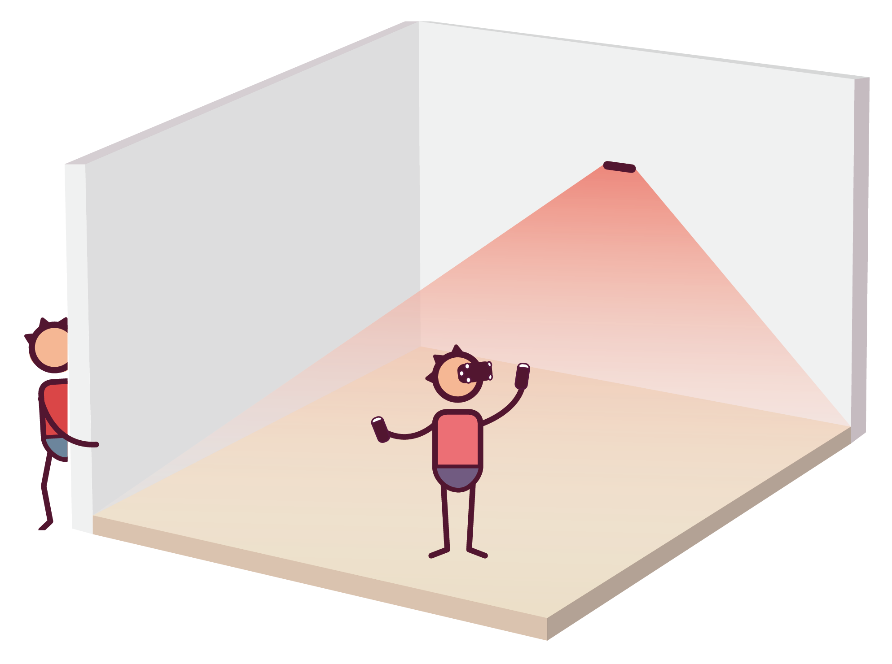

# Unboxing

# SDK
SDK API Documentation: https://ximmerse.github.io/SDK_Doc/
# Terminologies
* Outside-In Tracking: Tracking camera is mounted on a wall or on a tripod. Heading tracking is done by calculating the head tracking blob position.
* Inside-Out Tracking: Tracking camera is mounted on the HMD. Heading tracking is done by calculating HMD relative positon to external stationary marker blob.

# Intro to Ximmerse Dev Kit
## Hardware List
### DK03
### DK04 
### CV1

## Outside-In Solution
External camera tracks LED makers.

* Room-scale headset positional tracking
* Completely wireless
* Ultra low latency
* Easy setup
* Low cost

	

	
	

## Motion Controllers
Interactions and social in VR with a more immersive experience.

* 3 DOF / 6 DOF when working with stereo camera module
* Drift-free
* Standard controls
* MCU + BLE + IMU
* Low cost

## Room Scale Camera
The stereo camera uses a unique algorithm that is highly optimized to work with mobile VR.
