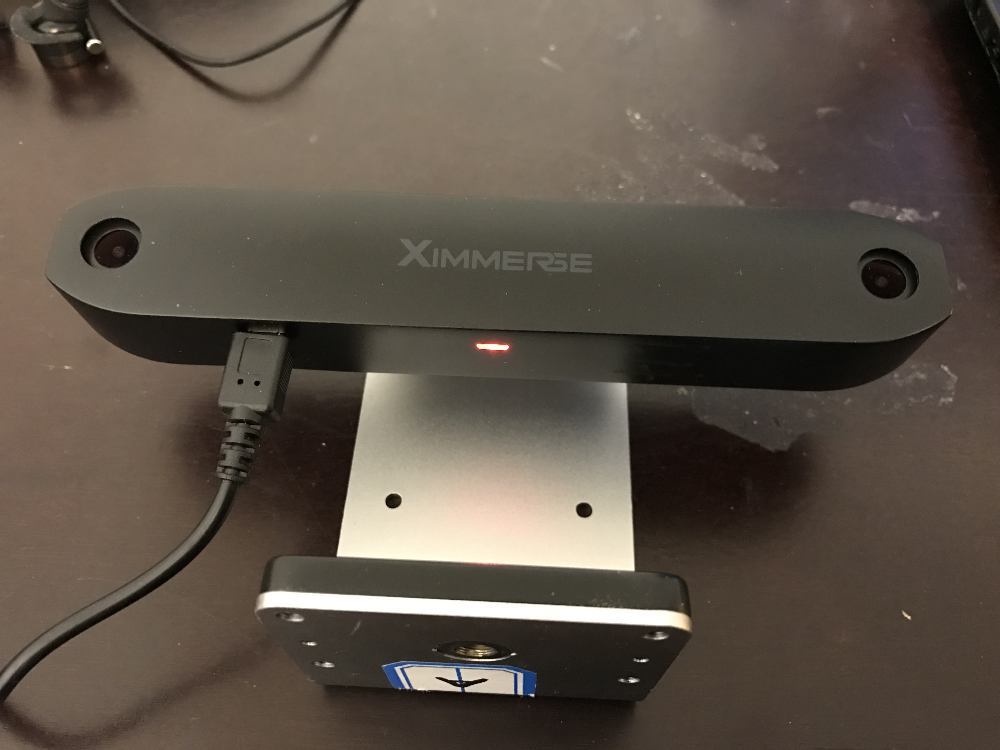

#Windows PC/ Mac OS X Setup(USB Dongle Required for PC)

1. Power up tracking camera with the provided USB cable.
>Note : The light on bottom of the camera will be flashing once connected to a power source. When you mount the camera on a wall or on a tripod, it is recommended to make sure the tracking camera is sitting at your eye level.
>
>Please make sure this tracking device is not attached to the same computer that you are developing on.

    

	
    

1. Connect head tracking blob to one of the USB ports on your PC.
>Note : The blue light on bottom of the tracking camera should start blinking in blue at this point.

1. `(Mac users skip to next step.)` At this point, you will only be able to get controller position data through tracking camera. To get controller button and IMU data, please follow the guide below:

    * Make sure both controllers are turned on.

    * Plug in [CSR 4.0 USB module](http://www.csr.com/products/bluecore-csr8510-a10-wlcsp) into one of your PC USB port. You can purchase a CSR 4.0 USB module online. A possible supplier can be found [here](https://www.amazon.com/BAIDATONG-Bluetooth-4-0-Micro-Adapter/dp/B00RZLTA6M/ref=sr_1_1?s=pc&ie=UTF8&qid=1484891771&sr=8-1&keywords=CSR+4.0+Dongle+Receiver+CSR+8510+Chipset). But you are free to choose your preffered supplier as long as the dongle your are purchasing uses `CSR8510™ A10 chipset`.

        

		
        

    * Download CSR Drivers [here](https://github.com/Ximmerse/SDK/tree/master/Drivers/CSR%20Drivers) and install the driver that is compatible to your Windows operation system.

    * Run ``"XDeviceMonitor.exe"`` executable which can be downloaded [here](https://github.com/Ximmerse/SDK/blob/master/Tools/PCSetupTools/XDeviceMonitor.rar?raw=true)

    * Most of the time, once ``"XDeviceMonitor.exe"`` starts, it should try to automatically search and pair your controllers. However, if this doesn't auto-connect after a while, you can always RIGHT click on controller icon and select ``"Auto-Connect"``.
        

		
        

    * Once both controllers are connected, the LED on the controllers should turn blue, and the icons in ``"XDeviceMonitor.exe"`` application should turn green with BLE address displayed.

        

		
        

1. Your hardware is now ready to be used on your PC or Mac. If our Unity SDK is downloaded(which can be downloaded [here](https://github.com/Ximmerse/SDK/tree/master/Unity)) and imported, you can run ``"02 - Pick Cubes"`` sample scene and start moving around. You can also run a quick [device test application](https://github.com/Ximmerse/SDK/blob/master/Tools/PCSetupTools/PC_Device_Test.zip?raw=true) to make sure your devices are working correctly on your PC or Mac.
