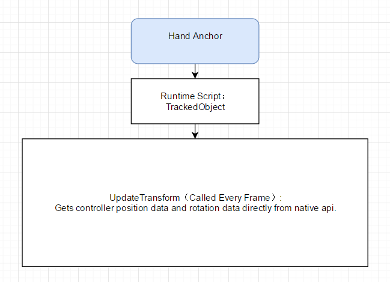

# Plugin Data Flow

  

  
  
  ***
  
  

  

  
  
  ***
  
  

  

  
  

***
# XDevicePlugin
## Description
XDevicePlugin is a bridge class that manages the communication between Unity Engine and native layer.

> Note: Normally, this class is NOT used directly in the engine, because the data from this class is raw data and must be further calculated to be used correctly.

## Namespace

    Ximmerse.InputSystem

## Structs
- `ControllerState`: Represents motion controller state.
- `TrackerState`: Contains tracking camera raw data.

## Static functions
- `void Init()`: Initialize the X-Device SDK library.
- `void Exit()`: De-Initialize X-Device SDK.
- `int GetInputDeviceHandle(string name)`: Get the handle of input device identified by name.
    * Parameters   
        - `XCobra-0`: Represents left controller.     
        - `XCobra-1`: Represents right controller.  
        - `XHawk-0`: Represents tracking camera.
    * Returns
        - If the result is 0 or larger than 0 (result>=0), the result is a valid handle.  
        - If the result is -1, the result is not valid and the device can't be found.
- `string GetInputDeviceName(int which)`: Get the name of the input device by handle.
    * Parameters  
        - Device handle.
    * Returns  
        - Device name.

***
# ControllerInput
## Description
A class that contains controller information such as button state, raw positions, raw rotations, etc.

## Namespace

    Ximmerse.InputSystem

## Enums
- `ControllerType`: A flag to indicate controller type.
- `ControllerRawAxis`: A collection of available axes. For Ximmerse devices, only `LeftTrigger`, `LeftThumbX`, `LeftThumbY` are being used.  
- `ControllerAxis`: Similar to `ControllerRawAxis`. For Ximmerse devices, only `PrimaryTrigger`, `PrimaryThumbX`, `PrimaryThumbY` are being used.  
- `ControllerRawButton`: Button state flags.
- `ControllerButton`: Button state flags.

## Public Functions
-   `void UpdateState()`: Must be called everyframe to update the data in the ControllerInput instance.    
-   `float GetAxis(int axisIndex)`: Returns Axis value with an axis index. Use 0 to get trigger value. Use 1 to get X axis value. Use 2 to get Y axis value.
-   `float GetAxis(ControllerRawAxis axisIndex)`: Returns the value of the virtual axis identified by axisIndex. Use ControllerRawAxis.LeftTrigger to get trigger value. Use ControllerRawAxis.LeftThumbX to get X axis value. Use ControllerRawAxis.LeftThumbY to get Y axis value.
-   `Vector3 GetPosition()`: Returns the current position of this controller local to its tracking space.  
-   `Quaternion GetRotation()`: Returns the current rotation of this controller local to its tracking space.
-   `Vector3 GetAccelerometer()`: Returns the current accelerometer info of this controller local to its tracking space.  
-   `Vector3 GetGyroscope()`: Returns the current gyroscope of this controller local to its tracking space.  
-   `XDevicePlugin.ControllerState GetState()`: Returns current controller state.
-   `XDevicePlugin.ControllerState GetPrevState()`: Returns previous controller state.
-   `void StartVibration(int type,float duration=0.0f)`: Vibrates the controller. Please use 0 as the type value for now.  
-   `void StopVibration()`: Stops Vibration.
-   `void Recenter()`: Reset Yaw of the controller.
-   `bool GetButton(DaydreamButton buttonMask)`: Returns a button state. Below is a picture to show the physical button and co-responding button mask.
-   `bool GetButtonUp(DaydreamButton buttonMask)`: If a button is released compared to last frame.
-   `bool GetButtonDown(DaydreamButton buttonMask)`: If a button is pressed compared to last frame.

    > Note : Please only use DaydreamButton enum to get button states.

    - `Touch Pad Click` : Co-responding Enum value is `DaydreamButton.Click`.
    - `App Button` : Co-responding Enum value is `DaydreamButton.App`.
    - `Power/Home Button` : Co-responding Enum value is `DaydreamButton.Home`.
    - `Grip Button(Left)` : Co-responding Enum value is `DaydreamButton.GripL`.
    - `Grip Button(Right)` : Co-responding Enum value is `DaydreamButton.GripR`.
    - `Index Trigger` : Co-responding Enum value is `DaydreamButton.Trigger`.

    

    | Ximmerse Device    | Co-responding Enum Value      |
    | ------------------ | ----------------------------- |
    | Touch Pad Click    | DaydreamButton.Click          |
    | App Button         | DaydreamButton.App            |
    | Power/Home Button  | DaydreamButton.Home           |
    | Grip Button(Left)  | DaydreamButton.GripL          |
    | Grip Button(Right) | DaydreamButton.GripR          |
    | Index Trigger      | ControllerRawAxis.LeftTrigger |
    | Touch Pad X Value  | ControllerRawAxis.LeftThumbX  |
    | Touch Pad Y Value  | ControllerRawAxis.LeftThumbY  |

***
# TrackedObject
## Description
A virtual representation of the controller in virtual world.
## Public fields
- `target`: If this is set in inspector, this TrackedObject instance will manipulate the target transform instead of the instance's own transform.
- `source`: Defines which hardware data source should be used.
- `usePosition`: If this is false, the position data from the tracking camera will be ignored.
- `useRotation`: If this is false, the rotation data from the controller devices will be ignored.

## Public Functions
- `void GetTransform(ref Vector3 position, ref Quaternion rotation)`: Gets position and rotation of the controller.
- `void UpdateTransform()`: Updates the transform of the controller. It is called in TrackedObject:Update().
- `void Recenter()`: Reset yaw.

***
# TrackedHead
## Description
Inherits from TrackedObject. This is a virtual representation of HMD in virtual world.
## Enums
- `TrackingType`: Tracking type. Only Outside-In is currently supported.

## Public Fields
- `trackingType`: Tracking type. Only Outside-In is currently supported.
- `markTransform`: Virtual representation of the head tracking blob.
- `keepPositionWhenLost`: This is recommended to be checked on all the time to ensure smoother head tracking experience.

## Public Functions
- `void GetTransform(ref Vector3 position, ref Quaternion rotation)`: Gets position and rotation of the HMD.

***
# ControllerInputManager
## Description
A helper class for managing ControllerInputs.
## Namespace

    Ximmerse.InputSystem

## Class
- `ControllerInfo`: A helper class to easily convert controller data into strings.

## Public Functions
- `void InitAllControllerInputs()`: Initialize all the devices.
- `void AddControllerInput(string name,ControllerInput controllerInput)`: Add additional ControllerInput for ControllerInputManager to manage.
- `ControllerInput GetControllerInput(string name)`: Get a reference to ControllerInput.

        using UnityEngine;
        using Ximmerse;
        using Ximmerse.InputSystem;
      
        class TestClass: MonoBehaviour
        {
            void Start()
            {
                ControllerInput leftController=ControllerInputManager.instance.GetControllerInput("LeftController");
                ControllerInput rightController=ControllerInputManager.instance.GetControllerInput("RightController");
            }
        }

- `ControllerInput GetControllerInput(ControllerType type)`: Get a reference to ControllerInput.

        using UnityEngine;
        using Ximmerse;
        using Ximmerse.InputSystem;
      
        class TestClass: MonoBehaviour
        {
            void Start()
            {
                ControllerInput lc=ControllerInputManager.instance.GetControllerInput(ControllerType.LeftController);
                ControllerInput rc=ControllerInputManager.instance.GetControllerInput(ControllerType.RightController);
            }
        }

## Static Functions
- `ControllerType ParseControllerType(string s)`: Convert strings into co-responding ControllerTypes.

***
# DeviceStatusManager
## Description
A helper class to easily access device status. The class is a singleton class, using Lazy Initialization.
## Public Members
- `LeftControllerConnectionState`: Get Left Controller Connection State.
- `RightControllerConnectionState`: Get Right Controller Connection State.
- `TrackingCameraConnectionState`: Get Tracking Camera Connection State.
- `LeftControllerBattery`: Left controller battery level. Ranging from 0-100;
- `RightControllerBattery`: Right controller battery level. Ranging from 0-100;
- `OnDeviceConnectionError`: A delegate to receive device connection errors.

## Static Members
- `Instance`: A pointer to ControllerInputManager singleton. The singleton is created when this is called the first time.

## Public Functions:
- `int GetErrorCode(ControllerType type)`: Returns the status of the device.  
***

# VRRaycaster
## Description
A version of implementation of BaseRaycaster which can be attached to any GameObject. Once this script is running, you will be able to interact with Unity GUI system with the laser beam shot from the ray caster. More details can be find [here](https://github.com/Ximmerse/SDK/blob/master/Unity/Readme.md#-vrraycaster).
## Namespace

    Ximmerse.UI
***
# VRInputModule
## Description
The class implements BaseInputModule, which enables you to manage multiple UI laser inputs. Details of usage can be found [here](https://github.com/Ximmerse/SDK/blob/master/Unity/Readme.md#-vreventsystem-).
## Namespace
    Ximmerse.UI

# Static Functions:
- `void TriggerVibration(PointerEventData e,float duration)`: Vibrates the controller upon UI interaction.

        using UnityEngine;
        using UnityEngine.EventSystems;
        using UnityEngine.UI;
        using Ximmerse.UI;
      
        public class ShowImageOnClick:MonoBehaviour, IPointerClickHandler
        {
            public RawImage target;
            public Texture source;
            public float vibrationTime=.25f;
      
            public void OnPointerClick(PointerEventData eventData)
            {
                if(target!=null)
                {
                    if(source==null)
                    {
                      source=GetComponent<RawImage>().texture;
                    }
                    target.texture=source;
                    VRInputModule.TriggerVibration(eventData,vibrationTime);
                }
            }
        }
