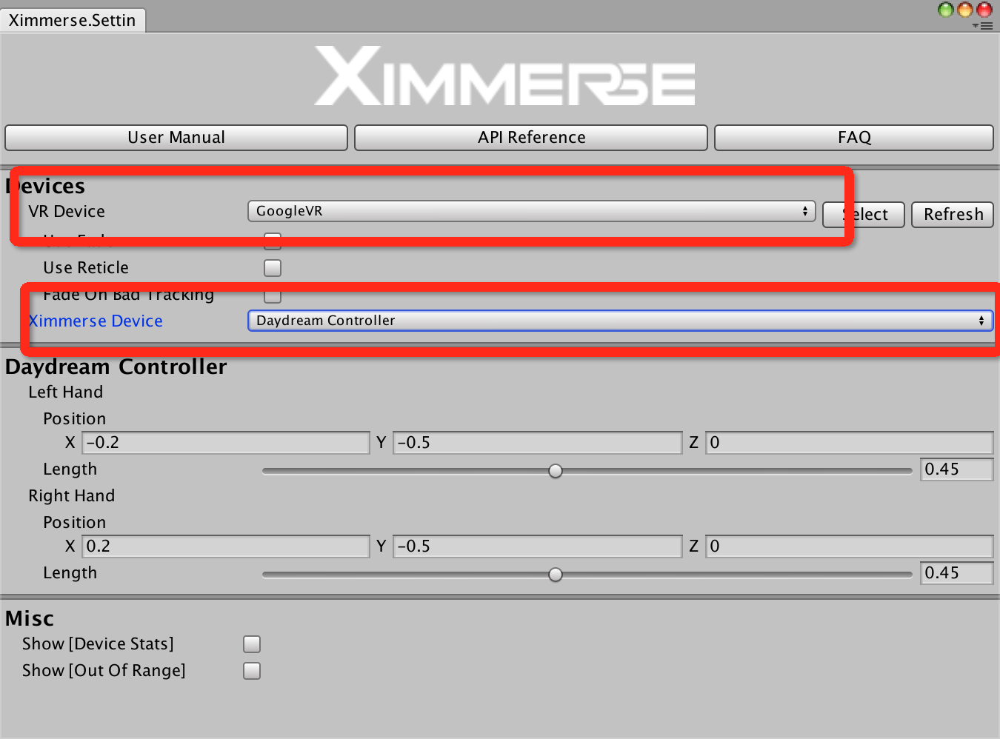
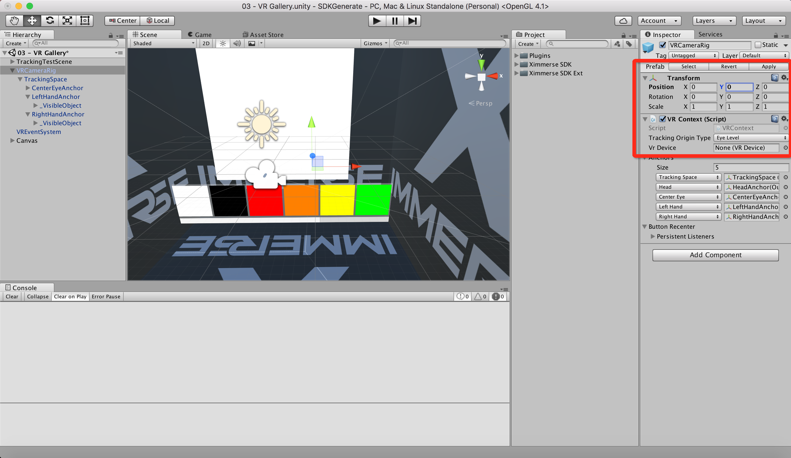
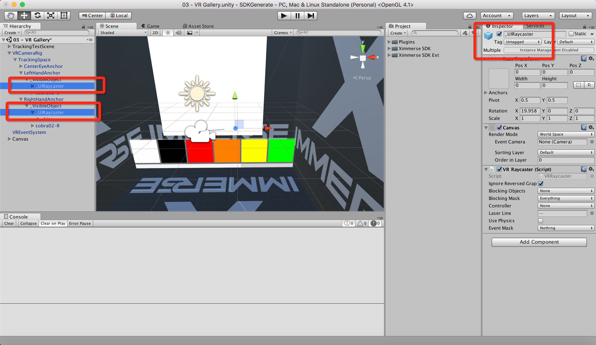
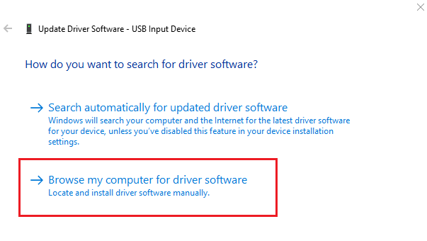
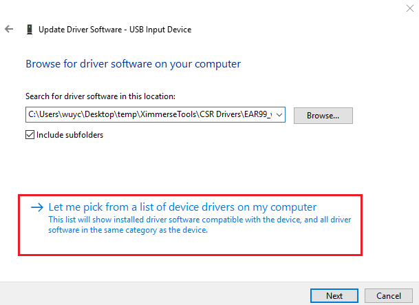
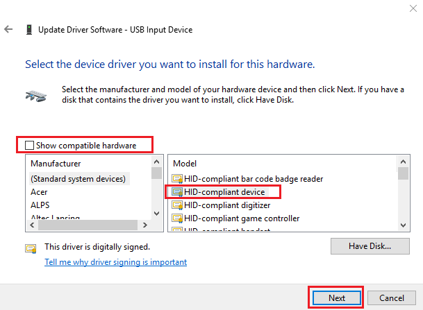

<h1> Unity SDK FAQ</h1>

**1. How to Get Controllers Positions and Rotations?**

> * You can simply get a reference to a TrackedObject and then grab the transform infomation by using

        public virtual void GetTransform(ref Vector3 position, ref Quaternion rotation);

> * You can also get transform data with ControllerInput class.

        using UnityEngine;
        using Ximmerse;
        using Ximmerse.InputSystem;
      
        class TestClass : MonoBehaviour
        {
            void Update()
            {
                ControllerInput lc = ControllerInputManager.instance.GetControllerInput(ControllerType.LeftController);
      
                Vector3 position = lc.GetPosition();
                Quaternion rotation = lc.GetRotation();
            }
        }

&emsp;

**2. How to Get Head Position and Rotation?**

> It is recommened to use `TrackedHead.target` to grab the head transform information,
because head position requires complex calculation, which is already done in `TrackHead.cs` script.

&emsp;

**3. How to Get Button Press/Down/State?**

> First of all, you need a reference to a `ControllerInput`. Example can be found [here](https://github.com/Ximmerse/SDK/blob/master/Unity/APIDoc.md).

> Then all you need to do is using `GetButton`/`GetButtonUp`/`GetButtonDown` functions implemented in the `ControllerInput` class. Details can be found [here](https://github.com/Ximmerse/SDK/blob/master/Unity/APIDoc.md).

**4. How to setup 3Dof demo working?**
> We have provided a 3Dof controller sample project in the Unity SDK. To get it working properly, please follow the steps below:
> 
>1. Go to Ximmerses Setting Panel and make sure Ximmerse Device is set to Daydream Controller. This is option to use Ximmerse controller in a similar way to Daydream 3dof controllers.
>	

>2. Go to VR Gallery scene. Set VRCameraRig positon to 0,0,0. 
>	

>
>3. Set _UIRayCaster objects to active. 
>	

>
>4. Build the project to your target platform and use your controllers to pick colors. 
>

**5. My Windows PC doesn't receive any position data.**
> If your device works on your phone, but it doesn't work on your windows PC. You may have a USB driver issue. Follow the following steps to get it solved:
> 	1. Go to "Device Manager" and check it you have any warning on any of the HID devices. 

>	2. Click on “Browse my computer for driver software”

>	3. Click on “Let me pick from…."

>	4. Select “HID-compliant device”, then hit “Next” to update the device driver.

